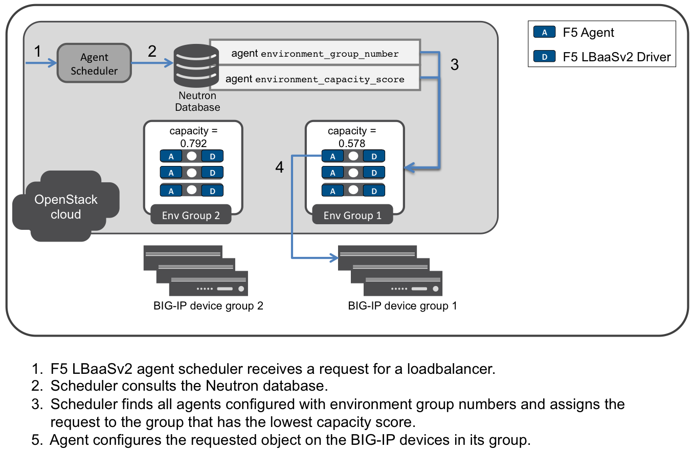

:orphan: true

Capacity-Based Scale Out
========================

Overview
--------

When using :ref:`differentiated service environments <Differentiated Service Environments>`, you can configure capacity metrics for the F5® agent to provide scale out across multiple BIG-IP device groups. The F5 agent :ref:`configuration parameters <Configure the F5 OpenStack Agent>`  ``environment_group_number`` and ``environment_capacity_score`` allow the F5 LBaaSv2 agent scheduler to assign requests to the group that has the lowest capacity score.

Each F5 agent is first configured, via the ``icontrol_endpoint`` parameter, to manage a BIG-IP device or device group. Agents with the same ``environment_group_number`` manage the same BIG-IP device group, regardless of whether they are configured with the same iControl® endpoints. This means that an agent can be configured to manage a specific device, but also be available to handle requests for its group.

You can configure a variety of capacity metrics via the ``capacity_policy`` configuration parameter. These metrics are used to calculate an ``environment_capacity_score`` for the environment group. Each agent calculates the capacity score for its group and reports the score back to the Neutron database.

The capacity score is determined by dividing the metric collected by the max specified for that metric in the ``capacity_policy`` setting. An acceptable reported ``environment_capacity_score`` is between zero (0) and one (1). **If an agent in the group reports an ``environment_capacity_score`` of one (1) or greater, the device is considered to be at capacity.**

    Capacity Based Scale Out

As demonstrated in the figure, when a new service request is received, the agent scheduler consults the Neutron database. It uses the ``environment_group_number`` and the group's last reported  ``environment_capacity_score`` to assign the task to  the group with the highest availability. An agent in that group is selected at random to handle the request.

If an agent has previously handled requests for the specified tenant, that agent receives the task. If that agent is a member of a group for which the last reported ``environment_capacity_score`` is above capacity, the  request is assigned to an agent in a different group where capacity is under the limit.

If the scheduler doesn't find an associated agent for the tenant when a new request is received,

.. warning::

    If all agents in all environment groups are at capacity, service requests will not be completed. LBaaS objects created in an environment that has no capacity left will be placed in the error state.

Use Case
--------

Capacity-based scale out provides redundancy and high availability amongst F5 agents responsible for managing a specific service environment. The capacity score each agent reports back to the Neutron database is used to assign tasks to the agent handling the fewest requests.

Prerequisites
-------------

- Licensed, operational BIG-IP :term:`device` and/or :term:`device group`.
- Operational OpenStack cloud (|openstack| release).
- Administrator access to both the BIG-IP devices and the OpenStack cloud.
- F5 ref:`agent <Install the F5 Agent>` and :ref:`LBaaSv2 driver <Install the F5 LBaaSv2 Driver>` installed on all hosts from which BIG-IP services will be provisioned.

Caveats
-------

- All hosts running F5 LBaaSv2 must use the same Neutron database.
- You **can not** run multiple agents on the same host if they are expected to manage the same BIG-IP device or :term:`cluster`.
- See :ref::ref:`differentiated service environments <Differentiated Service Environments>` for information about running more than one F5 agent/driver on the same host.

Configuration
-------------

1. Edit the :ref:`agent configuration file` to set the ``environment_group_number`` for each agent you'd like to be part of a :term:`device group`.

    .. note:: Each agent must be configured to manage at least one of the BIG-IP devices in the group.

    .. code-block:: text

        ###############################################################################
        #  Environment Settings
        ###############################################################################
        ...
        # When using service differentiated environments, the environment can be
        # scaled out to multiple device service groups by providing a group number.
        # Each agent associated with a specific device service group should have
        # the same environment_group_number.
        #
        # environment_group_number = 1
        #
        ...

2. Edit the :ref:`agent configuration file` to set the capacity score metrics.

    .. tip:: Multiple values can be configured; they should be separated by commas.

    * throughput - total throughput in bps of the TMOS devices
    * inbound_throughput - throughput in bps inbound to TMOS devices
    * outbound_throughput - throughput in bps outbound from TMOS devices
    * active_connections - number of concurrent active actions on a TMOS device
    * tenant_count - number of tenants associated with a TMOS device
    * node_count - number of nodes provisioned on a TMOS device
    * route_domain_count - number of route domains on a TMOS device
    * vlan_count - number of VLANs on a TMOS device
    * tunnel_count - number of GRE and VxLAN overlay tunnels on a TMOS device
    * ssltps - the current measured SSL TPS count on a TMOS device
    * clientssl_profile_count - the number of clientside SSL profiles defined

    .. code-block:: text

        ###############################################################################
        #  Environment Settings
        ###############################################################################
        ...
        #
        # capacity_policy = throughput:1000000000, active_connections: 250000, route_domain_count: 512, tunnel_count: 2048
        #

Further Reading
---------------

.. seealso::

    * :ref:`Agent Configuration File`
    * :ref::ref:`Differentiated Service Environments`
    * :ref:`Agent Redundancy and Scale Out`

