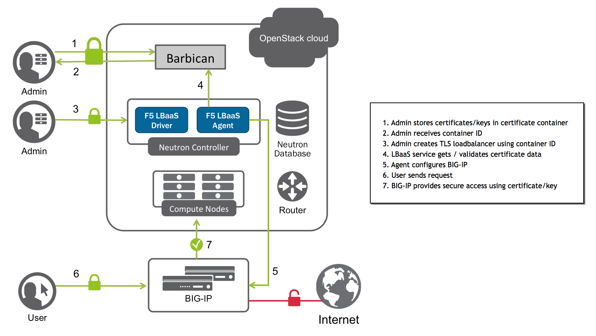

:orphan: true

.. _certificate-manager:

Certificate Manager / SSL Offloading
====================================

Overview
--------

OpenStack's 'Barbican' certificate manager provides a secure location where users can store sensitive information, such as SSH keys, private keys, certificates, and user passwords (referred to as "`secrets`_ " in OpenStack lingo).

The F5 agent uses Barbican certificates to perform :term:`SSL offloading` on BIG-IP. It allows users to either create a new SSL profile, or to designate an existing `BIG-IP SSL profile`_ as the parent from which client profiles created for LBaaS objects will inherit settings.

In general, SSL offloading frees up server and application capacity for handling traffic by shifting authentication processing from the target server to a designated authentication server. As shown in the diagram, once an admin user has added `secrets`_ to a Barbican container, he can use it to create a :ref:`TLS load balancer <Create a tls load balancer>`. After the certificate data is validated, the F5 agent configures the load balancer on the BIG-IP.

    SSL Offloading with OpenStack Barbican, Neutron LBaaSv2, and BIG-IP

Use Case
--------

When you configure `Client SSL`_ or `Server SSL`_ profiles and assign them to a virtual server, BIG-IP offloads SSL processing from the destination server. This not only conserves resources on the destination servers, but also enables the BIG-IP to customize SSL traffic processing according to your specifications.

`Client SSL`_ is the most common use case; this makes it possible for the BIG-IP to decrypt client requests before sending them on to a server, and encrypt server responses before sending them back to the client.

Prerequisites
-------------

- Licensed, operational BIG-IP :term:`device`.

- Operational OpenStack cloud (|openstack| release).

- Administrator access to both BIG-IP device(s) and OpenStack cloud.

- F5 LBaaSv2 driver and :ref:`agent <agent:home>` installed on each server for which BIG-IP LTM services are required.

- `OpenStack Barbican <OpenStack Barbican: https://wiki.openstack.org/wiki/Barbican>`_ certificate manager configured and operational.

- Existing `BIG-IP SSL profile <https://support.f5.com/kb/en-us/products/big-ip_ltm/manuals/product/bigip-ssl-administration-12-0-0/5.html#unique_527799714>`_ (*optional*).

Caveats
-------

None.

Configuration
-------------

1. Edit the :ref:`Agent Configuration File`:

.. code-block:: text

    $ sudo vi /etc/neutron/services/f5/f5-openstack-agent.ini

2. Enable the F5 Barbican certificate manager.

    - ``cert_manager = f5_openstack_agent.lbaasv2.drivers.bigip.barbican_cert.BarbicanCertManager``

3. Provide the Keystone authentication data for your environment.

    - ``auth_version``: Keystone version (``v2`` or ``v3``)
    - ``os_auth_url``: Keystone authentication URL
    - ``os_username``: OpenStack username
    - ``os_password``: OpenStack password
    - ``os_tenant_name``: OpenStack tenant name (v2 only)
    - ``os_user_domain_name``: OpenStack domain in which the user account resides (v3 only)
    - ``os_project_name``: OpenStack project name (v3 only; refers to the same data as ``os_tenant_name`` in v2)
    - ``os_project_domain_name``: OpenStack domain in which the project resides

.. topic:: Example

    .. code-block:: text
        :emphasize-lines: 8-14, 17-25

        #
        cert_manager = f5_openstack_agent.lbaasv2.drivers.bigip.barbican_cert.BarbicanCertManager
        #
        # Two authentication modes are supported for BarbicanCertManager:
        #   keystone_v2, and keystone_v3
        #
        #
        # Keystone v2 authentication:
        #
        # auth_version = v2
        # os_auth_url = http://localhost:5000/v2.0
        # os_username = admin
        # os_password = changeme
        # os_tenant_name = admin
        #
        #
        # Keystone v3 authentication:
        #
        auth_version = v3
        os_auth_url = http://localhost:5000/v3
        os_username = admin
        os_password = changeme
        os_user_domain_name = default
        os_project_name = admin
        os_project_domain_name = default
        #

4. Set the BIG-IP parent SSL profile.

    - ``f5_parent_ssl_profile``: The parent SSL profile on the BIG-IP from which the agent SSL profile should inherit settings

.. topic:: Example

    .. code-block:: text
        :emphasize-lines: 9

        # Parent SSL profile name
        #
        # A client SSL profile is created for LBaaS listeners that use TERMINATED_HTTPS
        # protocol. You can define the parent profile for this profile by setting
        # f5_parent_ssl_profile. The profile created to support TERMINATED_HTTPS will
        # inherit settings from the parent you define. This must be an existing profile,
        # and if it does not exist on your BIG-IP system the agent will use the default
        # profile, clientssl.
        #f5_parent_ssl_profile = clientssl
        #

.. Further Reading
    ---------------

.. _secrets: http://developer.openstack.org/api-guide/key-manager/secrets.html
.. _Client SSL: https://support.f5.com/kb/en-us/products/big-ip_ltm/manuals/product/bigip-ssl-administration-12-0-0/5.html#unique_202579324
.. _Server SSL: https://support.f5.com/kb/en-us/products/big-ip_ltm/manuals/product/bigip-ssl-administration-12-0-0/5.html#unique_128913226

