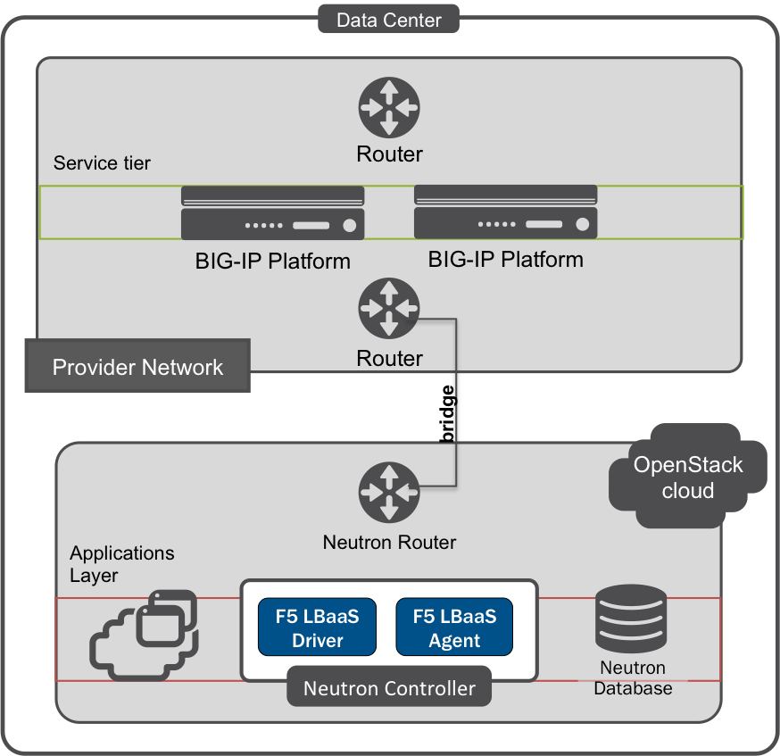

:orphan: true

.. _global-routed-mode:

Global Routed Mode
==================

Overview
--------

The F5 agent determines BIG-IP devices' L2 and L3 network configurations based on the settings provided in the :ref:`L2/L3 segmentation modes <L2 adjacent mode>` settings in the :ref:`agent configuration file`. When configured to use global routed mode, the F5 agent makes the following assumptions:

    #. LBaaS objects are accessible via global L3 routes;
    #. All virtual IPs are routable from clients;
    #. All pool members are routable from BIG-IP.

This means that all L2 and L3 objects, including routes, must be provisioned on your BIG-IP devices *before* you configure the F5 agent to manage them.

.. topic:: Example: Global Routed Mode

    .. figure:: ../media/f5-lbaas-global-routed-mode.png
        :width: 500
        :alt: Global Routed Mode

Use Case
--------

Global routed mode is generally used for :term:`undercloud` BIG-IP hardware deployments. The BIG-IP device(s) is deployed in the external :ref:`provider network <docs:provider-network>` at the service tier.

    Example BIG-IP 'undercloud' deployment

Global routed mode uses BIG-IP `secure network address translation`_ (SNAT) 'automapping' to map one or more origin IP addresses to a pool of translation addresses. The pool is created by the BIG-IP Local Traffic Manager (LTM) from existing `self IP`_ addresses. This means that *before* you configure the F5 agent to use global routed mode, you should create enough `self IP`_ addresses on the BIG-IP(s) to handle anticipated connection loads. [#]_ You do not need to configure a SNAT pool, as one will be created automatically.

Prerequisites
-------------

- Licensed, operational BIG-IP :term:`device`.

- Operational OpenStack cloud (|openstack| release).

- Administrator access to both BIG-IP device(s) and OpenStack cloud.

- F5 :ref:`LBaaSv2 driver <Install the F5 LBaaSv2 Driver>` and :ref:`agent <agent:home>` installed on each server for which BIG-IP LTM services are required.

- Understanding of `NATs and SNATs <https://support.f5.com/kb/en-us/products/big-ip_ltm/manuals/product/tmos-routing-administration-12-0-0/8.html#conceptid>`_.

- Sufficient `self IP`_ addresses for anticipated connection loads provisioned on the BIG-IP.

Caveats
-------

- In global routed mode, the underlying assumption is that all VIP L3 addresses are globally routable. Setting this mode to ``True`` means that all VIPs listen on all VLANs accessible to the BIG-IP.

- Because only one global routing space is used on the BIG-IP, overlapping IP addresses between tenants is not supported.

- All L3 routes must be set up on the BIG-IP before you provision LBaaS services.

Configuration
-------------

1. Edit the :ref:`Agent Configuration File`:

.. code-block:: text

    $ sudo vi /etc/neutron/services/f5/f5-openstack-agent.ini

2. Configure ``global_routed_mode`` and its dependent features.

    - ``global_routed_mode``: When set to ``True``, causes the agent to assume that all VIPs and pool members are reachable via global device L3 routes
    - ``use_namespaces``: Forced to ``False``; use of overlapping namespaces is not supported in global routed mode.
    - ``f5_snat_mode``: Forced to ``True``; forces the use of automap SNATs to allocate `self IP`_ addresses to LBaaS objects.
    - ``f5_snat_addresses_per_subnet``: Forced to ``0``; the device's local `self IP`_ is used to SNAT traffic.
    - ``f5_common_external_networks``: Value must be True or False; when set to True, all Neutron networks with the router type ``external`` are added to the global routing table (the `Common` partition on the BIG-IP) and placed in route domain ``0``.

.. topic:: Example

    .. code-block:: text
        :emphasize-lines: 13, 22, 46, 61

        ###############################################################################
        #  L3 Segmentation Mode Settings
        ###############################################################################
        #
        # Global Routed Mode - No L2 or L3 Segmentation on BIG-IP
        #
        # This setting will cause the agent to assume that all VIPs
        # and pool members will be reachable via global device
        # L3 routes, which must be already provisioned on the BIG-IPs.
        #
        ...
        #
        f5_global_routed_mode = True
        #
        # Allow overlapping IP subnets across multiple tenants.
        # This creates route domains on BIG-IP in order to
        # separate the tenant networks.
        #
        # This setting is forced to False if
        # f5_global_routed_mode = True.
        #
        use_namespaces = False
        #
        ...
        #
        ...
        #
        # SNAT Mode and SNAT Address Counts
        #
        # This setting will force the use of SNATs.
        #
        # If this is set to False, a SNAT will not
        # be created (routed mode) and the BIG-IP
        # will attempt to set up a floating self IP
        # as the subnet's default gateway address.
        # and a wild card IP forwarding virtual
        # server will be set up on member's network.
        # Setting this to False will mean Neutron
        # floating self IPs will no longer work
        # if the same BIG-IP device is not being used
        # as the Neutron Router implementation.
        #
        # This setting will be forced to True if
        # f5_global_routed_mode = True.
        #
        f5_snat_mode = True
        #
        # This setting will specify the number of snat
        # addresses to put in a snat pool for each
        # subnet associated with a created local Self IP.
        #
        # Setting to 0 (zero) will set VIPs to AutoMap
        # SNAT and the device's local Self IP will
        # be used to SNAT traffic.
        #
        ...
        #
        # This setting will be forced to 0 (zero) if
        # f5_global_routed_mode = True.
        #
        f5_snat_addresses_per_subnet = 0
        #

3. Configure ``f5_common_external_networks``.

.. topic:: Example

    .. code-block:: text
        :emphasize-lines: 5

        # This setting will cause all networks with
        # the router:external attribute set to True
        # to be created in the Common partition and
        # placed in route domain 0.
        f5_common_external_networks = True
        #

.. seealso::

    * :download:`Sample Agent Configuration file for Global Routed Mode <../_static/f5-openstack-agent.grm.ini>`

Further Reading
---------------

    * `TMOS Routing Overview <https://support.f5.com/kb/en-us/products/big-ip_ltm/manuals/product/tmos-routing-administration-12-0-0/2.html#conceptid>`_

    * `BIG-IP AutoMap SNAT <https://support.f5.com/kb/en-us/products/big-ip_ltm/manuals/product/tmos-routing-administration-12-0-0/8.html#unique_1573359865>`_

.. rubric:: Footnotes
.. [#] When using an :term:`overcloud` BIG-IP Virtual Edition (VE), IP addresses may be allocated automatically.

.. _secure network address translation: https://support.f5.com/kb/en-us/products/big-ip_ltm/manuals/product/tmos-routing-administration-12-0-0/8.html#unique_427846607
.. _self IP: https://support.f5.com/kb/en-us/products/big-ip_ltm/manuals/product/tmos-routing-administration-12-0-0/6.html#conceptid
.. _client-initiated (inbound) connections: https://support.f5.com/kb/en-us/products/big-ip_ltm/manuals/product/tmos-routing-administration-12-0-0/8.html#unique_847331455
.. _server-initiated (outbound) connections: https://support.f5.com/kb/en-us/products/big-ip_ltm/manuals/product/tmos-routing-administration-12-0-0/8.html#unique_1804816887

