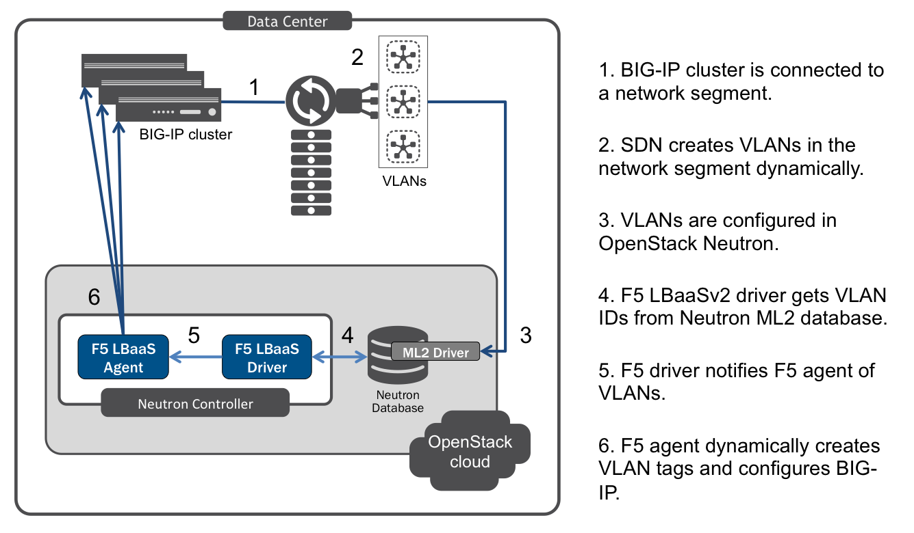

Hierarchical Port Binding
=========================

Overview
--------

Neutron `hierarchical port binding`_ [#]_ allows software-defined networking (SDN) users to dynamically configure VLANs and VLAN tags for a physical BIG-IP® :term:`device` or :term`device service cluster` connected to a 'top of rack' L3 switch (a network 'segment'). Telling the F5® agent what physical switch and port the BIG-IPs are connected to allows the agent to configure the BIG-IPs to process traffic for VLANs that are dynamically created in that segment.

Disconnected Services
`````````````````````

Because it is possible for LBaaSv2 objects to be provisioned on a Neutron network which has not yet been bound to a segment, the F5 agent can provision LBaaSv2 services in a disconnected state. When the agent discovers the intended network(s), these 'disconnected services' will be connected to the VLAN(s) and BIG-IP(s) as intended. You can customize how often the F5 agent will poll, and the maximum amount of time it should wait, for the network to be created before the request fails. This is, essentially, a fail-safe built into the F5 agent that allows for a certain degree of variation in the timing of the VLAN deployment and the request to create the LBaaS objects for it.

Use Case
--------

The most common use case for heirarchical port binding is an :term:`undercloud` deployment of a physical BIG-IP device or :term:`device service cluster` that processes traffic on networks dynamically created via SDN. When the F5 agent is configured with the name of a switch and the port(s) to which BIG-IP devices are connected, the LBaaSv2 driver discovers  Neutron networks in that switch's network segment. The driver provides the segmentation IDs of VLANs in the network segment to the F5 agent, which then dynamically creates the VLAN tags required to connect LBaaS services to the BIG-IPs.




    F5 LBaaSv2 Hierarchical Port Binding


Prerequisites
-------------

- Licensed, operational BIG-IP :term:`device` or :term:`device cluster`.

- Operational OpenStack cloud (|openstack| release).

- Administrator access to both BIG-IP device(s) and OpenStack cloud.

- Software Defined Networking (SDN) service.

- F5 :ref:`agent <agent:home>` and :ref:`service provider driver <install-f5-lbaasv2-driver>` installed on the Neutron controller and all other hosts for which you want to provision LBaaS services.

- Knowledge of `OpenStack Networking <http://docs.openstack.org/liberty/networking-guide/>`_ concepts.

- Knowledge of BIG-IP `system configuration`_, `local traffic management`_, & `device service clustering`_.


Caveats
-------

- In release v |release| of the F5 LBaaSv2 driver and agent, ``VLAN`` is the only supported ML2 network type.

- Each F5 agent managing a BIG-IP :term:`device service cluster` must have the same ``f5_network_segment_physical_network`` setting. [#]_

-  If multiple F5 agents are managing the same environment, all of the agents must use the same binding settings (in other words, either the default global segmentation bindings or hierarchical port binding). [#]_


Configuration
-------------

1. Edit the :ref:`Agent Configuration File`:

.. code-block:: text

    $ sudo emacs /etc/neutron/services/f5/f5-openstack-agent.ini


2. Configure the heirarchical port binding settings in the :ref:`L2/L3 Segmentation Modes` section of the config file.

.. table:: Hierarchical Port Binding settings

    +--------------------------------------+-------------------------------------------+---------------+
    | Setting                              | Description                               | Default Value |
    +======================================+===========================================+===============+
    |f5_network_segment_physical_network   || The name of the network segment in which | None          |
    |                                      || the agent will manage BIG-IP(s).         |               |
    +--------------------------------------+-------------------------------------------+---------------+
    |f5_network_segment_polling_interval   || Seconds between polling Neutron for a    | 10            |
    |                                      || ``network_id`` to ``segmentation_id``    |               |
    |                                      || mapping.                                 |               |
    |                                      || See :ref:`disconnected services`.        |               |
    +--------------------------------------+-------------------------------------------+---------------+
    |f5_network_segment_gross_timeout      || Maximum seconds to wait for a network to | 300           |
    |                                      || be bound before the LBaaS request fails. |               |
    |                                      || See :ref:`disconnected services`.        |               |
    +--------------------------------------+-------------------------------------------+---------------+


.. topic:: Example

    .. code-block:: text
        :emphasize-lines: 9, 14, 18

        # Hierarchical Port Binding
        #
        # If hierarchical networking is not required, these settings must be commented
        # out or set to None.
        #
        # Restrict discovery of network segmentation ID to a specific physical network
        # name.
        #
        # f5_network_segment_physical_network = <name-of-network-segment>
        #
        # Periodically scan for disconected listeners (a.k.a virtual servers).  The
        # interval is number of seconds between attempts.
        #
        # f5_network_segment_polling_interval = 10
        #
        # Maximum amount of time in seconds for wait for a network to become connected.
        #
        # f5_network_segment_gross_timeout = 300


3. Configure the related :ref:`L2/L3 Segmentation Modes` settings as appropriate for your environment.


Further Reading
---------------

.. seealso::

    .. [#] `Neutron Hierarchical Port Binding: What is it? And why you should deploy it <https://www.openstack.org/summit/vancouver-2015/summit-videos/presentation/neutron-hierarchical-port-binding-what-is-it-and-why-you-should-deploy-it>`_ - Presentation from the 2015 OpenStack Summit
    .. [#] See :ref:`Agent High Availability`
    .. [#] See :ref:`Differentiated Service Environments` and :ref:`Multi-tenancy`


.. _hierarchical port binding: https://specs.openstack.org/openstack/neutron-specs/specs/kilo/ml2-hierarchical-port-binding.html
.. _ML2: https://wiki.openstack.org/wiki/Neutron/ML2
.. _system configuration: https://support.f5.com/kb/en-us/products/big-ip_ltm/manuals/product/bigip-system-initial-configuration-12-0-0/2.html#conceptid
.. _local traffic management: https://support.f5.com/kb/en-us/products/big-ip_ltm/manuals/product/ltm-basics-12-0-0.html
.. _device service clustering: https://support.f5.com/kb/en-us/products/big-ip_ltm/manuals/product/bigip-device-service-clustering-admin-12-0-0.html


