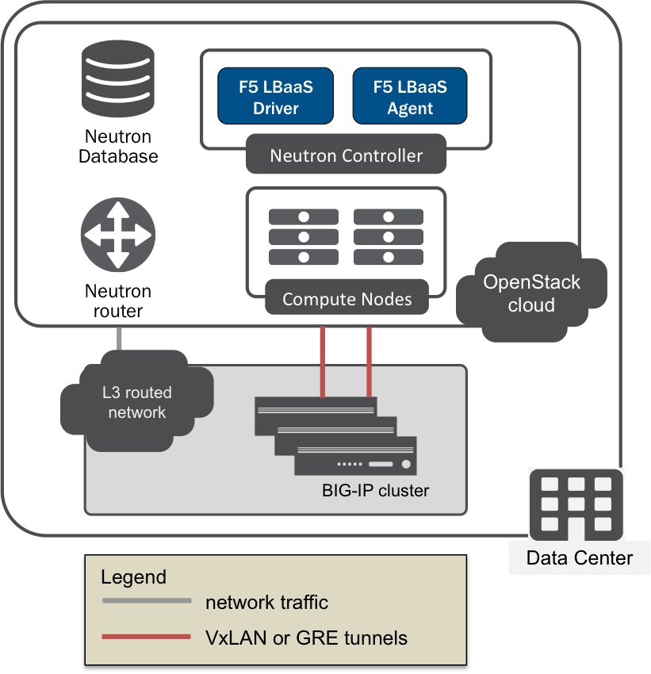

:orphan: true

L2 Adjacent Mode
================

Overview
--------

The F5 agent uses the L2/L3 segmentation mode settings to determine the L2/L3 network configurations for your BIG-IP device(s).

.. warning::

    These settings must be configured correctly for the F5 agent to manage your BIG-IP(s). Knowledge of networking concepts and BIG-IP configuration is required.

L2 segmentation mode settings:

* Mapping VLANs to BIG-IP device interfaces (with or without tagging)
* Mapping VLAN tags to specific BIG-IP ports
* Device tunneling self IPs
* Tunnel types


L3 segmentation mode settings:

* :ref:`Global routed mode` / Route domains
* SNAT Mode and SNAT Address Counts
* Common Networks
* L3 Bindings

Use Case
--------

Typically, the F5 agent is used to manage one (1) or more BIG-IP devices deployed at the service layer of an external :ref:`provider network <docs:provider-network>`. F5 LBaaSv2 makes it possible to provision services from your existing BIG-IP(s) in an OpenStack cloud. The F5 agent L2/L3 segmentation mode settings must match the configurations of your existing external network and BIG-IP device(s).

The default mode of operation for the F5 agent is **L2 adjacent mode** (``f5_global_routed_mode = False``).



    L2-adjacent BIG-IP cluster

.. important:: Knowledge of the external network configuration, and that of the BIG-IP device(s), is required to configure these settings.


Prerequisites
-------------

- Licensed, operational BIG-IP :term:`device` or :term:`device cluster`.

- Operational OpenStack cloud (|openstack| release).

- Administrator access to both the BIG-IP device(s) and the OpenStack cloud.

- Knowledge of `OpenStack Networking <http://docs.openstack.org/liberty/networking-guide/>`_ concepts.

- Knowledge of BIG-IP `system configuration`_, `local traffic management`_, & `device service clustering`_.

- VLANs and VxLAN or GRE tunnels configured as as appropriate for your environment.

- If you are using GRE or VxLAN tunnels, you must have a `BIG-IP license`_ that supports SDN.

Caveats
-------

- Many L3 segmentation mode parameters depend on other configuration parameters. It's important to read the text in the :ref:`agent configuration file` carefully before changing these settings to ensure they don't conflict.


Configuration
-------------

Edit the :ref:`Agent Configuration File` to configure the F5 agent.

.. code-block:: text

    $ sudo vi /etc/neutron/services/f5/f5-openstack-agent.ini

.. seealso::

    * :download:`Sample Agent Configuration file for VLAN (no tunnels) <../_static/f5-openstack-agent.vlan.ini>`
    * :download:`Sample Agent Configuration file for GRE <../_static/f5-openstack-agent.gre.ini>`
    * :download:`Sample Agent Configuration file for VXLAN <../_static/f5-openstack-agent.vxlan.ini>`


L2 Segmentation Mode
````````````````````

Device VLAN to interface and tag mapping
~~~~~~~~~~~~~~~~~~~~~~~~~~~~~~~~~~~~~~~~

- ``f5_external_physical_mappings``: Maps VLANs to BIG-IP interfaces. Must use the following format:

    .. code-block:: text

        physical_network:interface_name:tagged

\
    * ``physical_network``: The external physical network; corresponds to the Neutron ``provider:physical_network`` attribute.

    * ``interface_name``: The name of a BIG-IP interface or LAG trunk

    * ``tagged``: Value must be True or False; indicates whether or not VLAN tagging should be enforced by the BIG-IP.

    **Example**

    .. code-block:: text
        :emphasize-lines: 31

        ###############################################################################
        #  L2 Segmentation Mode Settings
        ###############################################################################
        #
        # Device VLAN to interface and tag mapping
        #
        # For pools or VIPs created on networks with type VLAN we will map
        # the VLAN to a particular interface and state if the VLAN tagging
        # should be enforced by the external device or not.  This setting
        # is a comma separated list of the following format:
        #
        #    physical_network:interface_name:tagged, physical:interface_name:tagged
        #
        # where :
        #   physical_network corresponds to provider:physical_network attributes
        #   interface_name is the name of an interface or LAG trunk
        #   tagged is a boolean (True or False)
        #
        # If a network does not have a provider:physical_network attribute,
        # or the provider:physical_network attribute does not match in the
        # configured list, the 'default' physical_network setting will be
        # applied. At a minimum you must have a 'default' physical_network
        # setting.
        #
        # standalone example:
        #   f5_external_physical_mappings = default:1.1:True
        #
        # pair or scalen (1.1 and 1.2 are used for HA purposes):
        #   f5_external_physical_mappings = default:1.3:True
        #
        f5_external_physical_mappings = default:1.1:True
        #

VLAN device and interface to port mappings
~~~~~~~~~~~~~~~~~~~~~~~~~~~~~~~~~~~~~~~~~~

- ``vlan_binding_driver``: Binds tagged VLANs to specific BIG-IP ports; it should be configured using a valid subclass of the iControl :class:`VLANBindingBase` class. [#]_ **To use this feature, uncomment the line in the :ref:`agent configuration file`.**


Device Tunneling (VTEP) selfips
~~~~~~~~~~~~~~~~~~~~~~~~~~~~~~~

- ``f5_vtep_folder``: This is the name of the BIG-IP folder or partition in which the `VTEP`_ (VxLAN tunnel endpoint) resides; the default partition is 'Common'.

- ``f5_vtep_selfip_name``: The name of the self IP assigned to the VTEP. The self IP must be configured on the BIG-IP **before** you configure the F5 agent.

    **Example**

    .. code-block:: text
        :emphasize-lines: 9, 10

        # Device Tunneling (VTEP) selfips
        #
        # This is a single entry or comma separated list of cidr (h/m) format
        # selfip addresses, one per BIG-IP device, to use for VTEP addresses.
        #
        # If no gre or vxlan tunneling is required, these settings should be
        # commented out or set to None.
        #
        f5_vtep_folder = Common
        f5_vtep_selfip_name = vtep
        #


Tunnel Types
~~~~~~~~~~~~

- ``advertised_tunnel_types``: The type of tunnel(s) being used to connect the BIG-IP device(s) to controller/compute node(s) in OpenStack; can be GRE or VxLAN. Values should be comma-separated if more than one tunnel type is being used. If you are not using tunnels, leave this setting blank.

    **Example**

    .. code-block:: text
        :emphasize-lines: 14

        # Tunnel types
        #
        # This is a comma separated list of tunnel types to report
        # as available from this agent as well as to send via tunnel_sync
        # rpc messages to compute nodes. This should match your ml2
        # network types on your compute nodes.
        #
        # If you are using only gre tunnels it should be:
        #
        # advertised_tunnel_types = gre
        #
        # If you are using only vxlan tunnels it should be:
        #
        advertised_tunnel_types = vxlan
        #
        # If this agent could get both gre and vxlan tunnel networks:
        #
        # advertised_tunnel_types = gre,vxlan
        #
        # If you are using only vlans only it should be:
        #
        # advertised_tunnel_types =
        #


Static ARP population for members on tunnel networks
~~~~~~~~~~~~~~~~~~~~~~~~~~~~~~~~~~~~~~~~~~~~~~~~~~~~

- ``f5_populate_static_arp``: Value must be True or False; indicates whether or not static arp entries are added for pool member IP addresses that are associated with VxLAN or GRE tunnel networks.

- ``l2_population``: Value must be True or False; indicates whether or not BIG-IP uses L2 population service to update fbd tunnel entries.

    **Example**

    .. code-block:: text
        :emphasize-lines: 9, 18

        # Static ARP population for members on tunnel networks
        #
        # This is a boolean True or False value which specifies
        # that if a Pool Member IP address is associated with a gre
        # or vxlan tunnel network, in addition to a tunnel fdb
        # record being added, that a static arp entry will be created to
        # avoid the need to learn the member's MAC address via flooding.
        #
        # f5_populate_static_arp = True
        #
        ...
        # This is a boolean entry which determines if the BIG-IP will use
        # L2 Population service to update its fdb tunnel entries. This needs
        # to be setup in accordance with the way the other tunnel agents are
        # setup.  If the BIG-IP agent and other tunnel agents don't match
        # the tunnel setup will not work properly.
        #
        l2_population = True
        #


L3 Segmentation Mode
````````````````````

.. note::

    This section covers L3 Segmentation Mode Settings with the assumption that :ref:`Global Routed Mode` is set to 'False'. This is the default mode of operation.

Namespaces and Routing
~~~~~~~~~~~~~~~~~~~~~~

- ``use_namespaces``: Value must be True or False; indicates whether or not traffic should be routed according to tenant routing tables. Setting this value to True allows subnet IP addresses to overlap.

    **Example**

    .. code-block:: text
        :emphasize-lines: 8

        # Allow overlapping IP subnets across multiple tenants.
        # This creates route domains on BIG-IP in order to
        # separate the tenant networks.
        #
        # This setting is forced to False if
        # f5_global_routed_mode = True.
        #
        use_namespaces = True
        #

- ``max_namespaces_per_tenant``: Value must be an integer; indicates the maximum number of route domains allowed per tenant. This allows a tenant to have overlapping IP subnets.

    **Example**

    .. code-block:: text
        :emphasize-lines: 27

        # When use_namespaces is True there is normally only one route table
        # allocated per tenant. However, this limit can be increased by
        # changing the max_namespaces_per_tenant variable. This allows one
        # tenant to have overlapping IP subnets.
        #
        # Supporting multiple IP namespaces allows establishing multiple independent
        # IP routing topologies within one tenant project, which, for example,
        # can accommodate multiple testing environments in one project, with
        # each testing environment configured to use the same IP address
        # topology as each other test environment.
        #
        # From a practical point of view, allowing multiple IP namespaces
        # per tenant results in a more complicated configuration scheme
        # for big-ip and also allows a single tenant to consumes more
        # routing tables, which are a limited resource. In order to keep
        # a simple one-to-one strategy of one tenant to one route domain,
        # it is recommended that separate projects be used if possible to
        # establish a new routing namespace rather than allowing multiple route
        # domains within one tenant.
        #
        # If a tenant attempts to use a subnet that overlaps with an existing
        # subnet that is already in use in the existing route domain(s), and
        # this setting is not high enough to accomodate a new route domain to
        # handle the new subnet, then the relevant lbaas element (vip or pool member)
        # will be set to the error state.
        #
        max_namespaces_per_tenant = 1
        #

- ``f5_route_domain_strictness``: Value must be True or False; indicates whether VIPS and members in different tenants can communicate with each other. In other words, setting this value to true forces tenant routing tables to be preferred over the global routing table.

    **Example**

    .. code-block:: text
        :emphasize-lines: 8

        # Dictates the strict isolation of the routing
        # tables.  If you set this to True, then all
        # VIPs and Members must be in the same tenant
        # or less they can't communicate.
        #
        # This setting is only valid if use_namespaces = True.
        #
        f5_route_domain_strictness = False
        #


SNAT Mode and SNAT Address Counts
~~~~~~~~~~~~~~~~~~~~~~~~~~~~~~~~~

.. tip:: SNATs ensure that server responses always return through the BIG-IP; they also allow you to hide the source addresses of server-initiated requests from external devices. Use of SNATs is recommended to ensure traffic is routed through the BIG-IP properly.

- ``f5_snat_mode``: Value must be True or False; indicates whether or not `SNATs`_ should be used.

- ``f5_snat_addresses_per_subnet``: Value must be an integer; indicates the number of `self IP`_ addresses the BIG-IP should put in a SNAT pool for each subnet associated with a self IP.

- ``f5_common_external_networks``: Value must be True or False; when set to True, traffic on all Neutron networks for which the router type is ``external`` will be routed according to the global routing table.

    **Example**

    .. code-block:: text
        :emphasize-lines: 19, 36, 42

        # SNAT Mode and SNAT Address Counts
        #
        # This setting will force the use of SNATs.
        #
        # If this is set to False, a SNAT will not
        # be created (routed mode) and the BIG-IP
        # will attempt to set up a floating self IP
        # as the subnet's default gateway address.
        # and a wild card IP forwarding virtual
        # server will be set up on member's network.
        # Setting this to False will mean Neutron
        # floating self IPs will no longer work
        # if the same BIG-IP device is not being used
        # as the Neutron Router implementation.
        #
        # This setting will be forced to True if
        # f5_global_routed_mode = True.
        #
        f5_snat_mode = True
        #
        # This setting will specify the number of snat
        # addresses to put in a snat pool for each
        # subnet associated with a created local Self IP.
        #
        # Setting to 0 (zero) will set VIPs to AutoMap
        # SNAT and the device's local Self IP will
        # be used to SNAT traffic.
        #
        # In scalen HA mode, this is the number of snat
        # addresses per active traffic-group at the time
        # a service is provisioned.
        #
        # This setting will be forced to 0 (zero) if
        # f5_global_routed_mode = True.
        #
        f5_snat_addresses_per_subnet = 1
        #
        # This setting will cause all networks with
        # the router:external attribute set to True
        # to be created in the Common partition and
        # placed in route domain 0.
        f5_common_external_networks = True
        #


Common Networks
~~~~~~~~~~~~~~~

- ``common_network_ids``: This should be a 'name-value' pair; multiple values can be comma-separated. The first entry is the Neutron network ID; the second is the network name (as configured on the BIG-IP).

    **Example**

    .. code-block:: text
        :emphasize-lines: 21, 26

        # Common Networks
        #
        # This setting contains a name value pair comma
        # separated list where if the name is a neutron
        # network id used for a vip or a pool member,
        # the network should not be created or deleted
        # on the BIG-IP, but rather assumed that the value
        # is the name of the network already created in
        # the Common partition with all L3 addresses
        # assigned to route domain 0.  This is useful
        # for shared networks which are already defined
        # on the BIG-IP prior to LBaaS configuration. The
        # network should not be managed by the LBaaS agent,
        # but can be used for VIPs or pool members
        #
        # If your Internet VLAN on your BIG-IP is named
        # /Common/external, and that corresponds to
        # Neutron uuid: 71718972-78e2-449e-bb56-ce47cc9d2680
        # then the entry would look like:
        #
        # common_network_ids = 71718972-78e2-449e-bb56-ce47cc9d2680:external
        #
        # If you had multiple common networks, they are simply
        # comma separated like this example:
        #
        # common_network_ids = 71718972-78e2-449e-bb56-ce47cc9d2680:external,396e06a0-05c7-4a49-8e86-04bb83d14438:vlan1222
        #
        # The default is no common networks defined


L3 Binding
~~~~~~~~~~

The L3 Binding driver is **required** for BIG-IP VE(s) deployed within your OpenStack cloud. This setting binds L3 addresses to specific ports to allow communications between Nova guest instances.

- ``l3_binding_driver``: uncomment this line in the :ref:`agent configuration file` if you're using an :term:`overcloud` VE.

    **Example**

    .. code-block:: text
        :emphasize-lines: 2

        #
        l3_binding_driver = f5_openstack_agent.lbaasv2.drivers.bigip.l3_binding.AllowedAddressPairs
        #


Further Reading
---------------

.. seealso::

    * `BIG-IP System - Initial Configuration <https://support.f5.com/kb/en-us/products/big-ip_ltm/manuals/product/bigip-system-initial-configuration-12-0-0/2.html#conceptid>`_
    * `BIG-IP Local Traffic Management Basics <https://support.f5.com/kb/en-us/products/big-ip_ltm/manuals/product/ltm-basics-12-0-0.html>`_
    * `BIG-IP Routing Administration Guide <https://support.f5.com/kb/en-us/products/big-ip_ltm/manuals/product/tmos-routing-administration-12-0-0/5.html#conceptid>`_
    * `BIG-IP Device Service Clustering Administration <https://support.f5.com/kb/en-us/products/big-ip_ltm/manuals/product/bigip-device-service-clustering-admin-12-0-0.html>`_


.. rubric:: Footnotes
.. [#] Unsupported in v |release|


.. _system configuration: https://support.f5.com/kb/en-us/products/big-ip_ltm/manuals/product/bigip-system-initial-configuration-12-0-0/2.html#conceptid
.. _local traffic management: https://support.f5.com/kb/en-us/products/big-ip_ltm/manuals/product/ltm-basics-12-0-0.html
.. _device service clustering: https://support.f5.com/kb/en-us/products/big-ip_ltm/manuals/product/bigip-device-service-clustering-admin-12-0-0.html
.. _VTEP: https://support.f5.com/kb/en-us/products/big-ip_ltm/manuals/product/bigip-tmos-tunnels-ipsec-12-0-0/3.html#unique_1403984487
.. _SNATs: https://support.f5.com/kb/en-us/products/big-ip_ltm/manuals/product/tmos-routing-administration-12-0-0/8.html#unique_427846607
.. _self IP: https://support.f5.com/kb/en-us/products/big-ip_ltm/manuals/product/tmos-routing-administration-12-0-0/6.html#conceptid
.. _BIG-IP license: https://f5.com/products/how-to-buy/simplified-licensing

